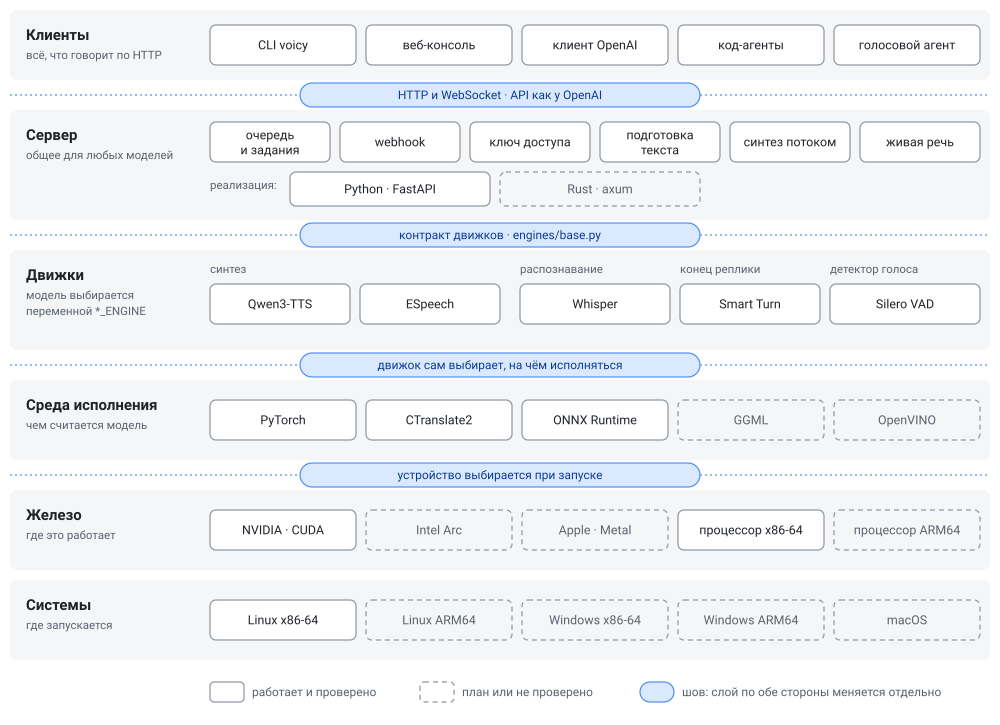

# voicy

Локальный сервер для работы с голосом: синтез речи с клонированием голоса,
распознавание и субтитры, голосовой агент в реальном времени. **API совместимо
с аудио-частью OpenAI**, так что готовые клиенты работают, если сменить базовый
адрес. Всё исполняется на своей машине: звук и текст никуда не уходят, после
первой загрузки весов сеть не нужна.

```bash
curl -O https://raw.githubusercontent.com/olluorg/voicy/master/compose.yml
docker compose up -d
```

Консоль — `http://localhost:8080`, API — `http://localhost:8080/v1`.

## Что умеет

**Синтез речи**
- Клонирует голос по образцу в 8–14 секунд, записанному хоть на телефон.
  Расшифровку образца сервер делает сам. Готовых голосов два.
- Форматы `opus`, `mp3`, `wav`, `flac`, `aac`, `pcm`. Темп 0.8–1.2 меняется
  растяжением готового звука: так разборчивость не падает.
- Длинный текст ставится заданием, для живого разговора есть синтез потоком.
- Инженерный текст: словарь произношений на 79 терминов и режим, который убирает
  запятые внутри коротких фраз, — модель читает запятую как повод остановиться.

**Распознавание**
- Текст, `srt`, `vtt`, сегменты и слова со временем, перевод на английский.
- Термины слышатся правильно (Kafka, а не «кавка»): для этого есть hotwords
  и именованные профили контекста с заменами.
- Текст приходит по мере распознавания, не дожидаясь конца файла.

**Голосовой агент** — два WebSocket.
- Слушающая сторона: начало речи (чтобы замолчать, когда перебили), текст
  по предложениям и конец реплики по интонации, а не по паузе.
- Говорящая сторона: принимает текст токенами прямо из LLM и отдаёт звук кусками.
  Первый звук приходит через 3 секунды, при перебивании синтез отменяется.

**Для работы в сервисе**
- Все запросы идут через одну очередь: у каждого есть id, прогресс, отмена
  и webhook по готовности.
- Ключ доступа, ошибки в формате OpenAI, проверенная работа за nginx.
- Docker или запуск из исходников; видеокарта не обязательна.

**Сменные модели.** Сервер не знает, как устроена модель: синтез, распознавание,
детекторы конца реплики и голоса стоят за общим контрактом, и модель выбирается
переменной окружения. Почему это держится — [ADR 0021](docs/adr/0021-engine-contract.md).

## Как устроено



Пять слоёв, и любой из них меняется, не трогая соседей, потому что между ними
стоят швы:

- **HTTP и WebSocket API** отделяет клиентов от сервера. Клиенту всё равно,
  на чём написан сервер: рядом с сервером на Python уже работает такой же
  на Rust ([`rust/`](rust/README.md)), и оба проходят один набор проверок.
- **Контракт движков** (`server/engines/base.py`) отделяет сервер от моделей.
  Сервер говорит на языке API — секунды звука, коды языков, текст — и не знает,
  как устроена модель. Контракт проверен двумя непохожими моделями синтеза
  ([ADR 0021](docs/adr/0021-engine-contract.md)).
- **Среду исполнения выбирает движок.** Одна и та же модель может считаться
  на PyTorch, ONNX Runtime или GGML, и серверу это не важно.
- **Устройство выбирается при запуске:** та же сборка работает с видеокартой
  и без неё.

Пунктиром на схеме — то, чего ещё нет или что не проверялось. С настоящими
моделями сервер проверен на Linux x86-64 (в том числе под WSL2 на Windows)
с NVIDIA и без видеокарты. На Windows, macOS и ARM64 он запускается и проходит
проверки с учебными движками (CI), с моделями там не гонялся. Цель — Windows,
Linux и macOS на x86-64 и ARM64, видеокарты NVIDIA, Intel Arc и Apple silicon.
На каждом железе — свой самый быстрый путь: охват не покупается скоростью
там, где она уже есть. Как туда идти — [ADR 0022](docs/adr/0022-rust-migration-and-hardware.md).

## Как пользоваться

**Командная строка** — `./voicy`, один файл без зависимостей:

```bash
./voicy up                                   # поднять сервер и прогреть модели
./voicy say "Текст" out.opus                 # синтез
./voicy say @статья.md out.opus --voice dostoevsky --speed 0.9
./voicy hear запись.opus --format srt        # субтитры
./voicy hear созвон.opus --context engineering
./voicy add-voice образец.wav мой-голос      # свой голос
ID=$(./voicy say @книга.md --detach)         # длинное — заданием
./voicy job $ID out.opus --wait
```

**Клиент OpenAI** — тот же код, другой адрес:

```python
from openai import OpenAI
client = OpenAI(base_url="http://localhost:8080/v1", api_key="not-needed")

client.audio.speech.create(model="tts-1", voice="turgenev", input="Текст",
                           response_format="opus").stream_to_file("out.opus")
text = client.audio.transcriptions.create(model="whisper-1",
                                          file=open("out.opus", "rb")).text
```

**Веб-консоль** на `http://localhost:8080` работает в двух режимах.
В простом — поле для текста и одна кнопка, плюс запись с микрофона. В подробном
видны все настройки, есть управление голосами и готовые примеры кода.

Маршруты, параметры, протоколы WebSocket, очередь и webhook, ключ доступа
и настройка прокси — в [`server/README.md`](server/README.md). Код-агенту,
которому нужен звук, достаточно [`AGENTS.md`](AGENTS.md).

## Запуск

Сервер ставится двумя путями: **docker** (готовый образ, ничего не собирать)
или **из исходников** (нужен Python 3.12). `./voicy up` выбирает сам: жив
docker — образ, нет — исходники. Явно — `--docker` или `--source`.

Первый запуск скачивает около пяти гигабайт весов, дальше они лежат в кэше.
Без видеокарты всё работает, но синтез медленнее реального времени
(`./voicy up --cpu`, в docker — `-e FORCE_CPU=1`); насколько — не мерилось. Для `opus`, `mp3`, `flac`,
`aac` и изменения темпа нужен `ffmpeg`: в образе он есть, из исходников —
системный.

Что где проверено:

| | docker | из исходников |
|---|---|---|
| Linux x86-64, NVIDIA | проверено | проверено |
| Linux x86-64, без видеокарты | работает, скорость не мерилась | работает, скорость не мерилась |
| Windows x86-64, NVIDIA, через WSL2 | не проверялось | проверено |
| Windows x86-64, напрямую | — | не проверялось с моделями |
| macOS, Apple silicon | эмуляция x86-64, очень медленно | не проверялось с моделями, только процессор |

### Docker — любая система

```bash
curl -O https://raw.githubusercontent.com/olluorg/voicy/master/compose.yml
docker compose up -d
```

`compose.yml` добавляет тома для весов и голосов, перезапуск и проброс GPU.
То же без compose:

```bash
docker run -d --gpus all -p 8080:8080 -v voicy-models:/cache -v voicy-voices:/app/server/voices ghcr.io/olluorg/voicy:latest
```

Образ — Linux x86-64 с CUDA. На Windows нужен Docker Desktop с WSL2, а для GPU
ещё обычный драйвер NVIDIA, CUDA внутри Windows ставить не надо. В PowerShell
вместо `curl` — `curl.exe`. Без видеокарты — без `--gpus all` и с
`-e FORCE_CPU=1`.

### Linux

```bash
sudo apt install ffmpeg                  # или dnf/pacman
curl -LsSf https://astral.sh/uv/install.sh | sh     # uv сам достанет Python 3.12
git clone https://github.com/olluorg/voicy && cd voicy
./voicy up --source --install            # зависимости в .venv, запуск, прогрев
./voicy say "Проверка связи." out.opus
```

`--install` ставит torch под CUDA, если есть `nvidia-smi`, и под процессор,
если нет. Это гигабайты и не быстро; повторный `./voicy up` уже ничего не
ставит. Сервер живёт обычным процессом: pid и журнал — в `.voicy/`, остановка —
`./voicy down`.

### Windows

Проще и проверено — через **WSL2**: `wsl --install -d Ubuntu`, дальше внутри
Ubuntu всё как в разделе Linux. Видеокарта NVIDIA видна из WSL2 с обычным
драйвером Windows. Консоль и API открываются из Windows по
`http://localhost:8080`.

Напрямую, без WSL — в PowerShell:

```powershell
winget install Python.Python.3.12 Git.Git astral-sh.uv Gyan.FFmpeg
git clone https://github.com/olluorg/voicy; cd voicy
python voicy up --source --install
python voicy say "Проверка связи." out.opus
```

CLI — Python-скрипт, поэтому на Windows он запускается как `python voicy …`.
Так сервер стартует и проходит проверки с учебными движками, но с настоящими
моделями на Windows он ещё не гонялся: если что-то не так, пишите в issues.

### macOS

```bash
brew install uv ffmpeg git
git clone https://github.com/olluorg/voicy && cd voicy
./voicy up --source --install
```

Считает процессор: видеокарту Apple (MPS, Metal) движки пока не используют,
поэтому синтез заметно медленнее реального времени.
С настоящими моделями на macOS сервер ещё не гонялся. Образ docker на Apple
silicon идёт под эмуляцией x86-64 и для работы непригоден.

### Сервер на Rust — одним бинарником

Тот же API без Python во время работы: все модели исполняются в самом
процессе. На RTX 3080 синтез почти втрое быстрее (×3.8 к реальному времени
против ×1.4), распознавание с той же точностью, видеопамяти 5.7 ГБ вместо 9.3
(experiments/20, 22). Пока **только Linux x86-64 с NVIDIA**: библиотеки под
другие платформы есть, сборки и замеры — впереди.

```bash
sudo apt install build-essential ffmpeg           # g++ для обёртки над CTranslate2
curl https://sh.rustup.rs -sSf | sh               # Rust
uv venv --python 3.12 .venv                       # Python нужен один раз — перевести Qwen3-TTS
uv pip install --python .venv torch torchaudio --index-url https://download.pytorch.org/whl/cu128
uv pip install --python .venv -r server/requirements.txt onnx onnxscript gguf
.venv/bin/python scripts/native_setup.py all      # библиотеки и модели в ~/.cache/voicy
cargo build --release --manifest-path rust/Cargo.toml
rust/target/release/voicy serve --port 8080
```

`native_setup.py` качает готовые llama.cpp, CTranslate2 и ONNX Runtime
и один раз переводит Qwen3-TTS в GGUF и ONNX. Для этого ему нужен Python
с torch; самому серверу он не нужен. CLI `./voicy` работает с этим сервером
так же, как с Python-сервером. Подробности — [`rust/README.md`](rust/README.md).

## Модели

| | По умолчанию | Ещё | Выбор |
|---|---|---|---|
| синтез | Qwen3-TTS 1.7B | ESpeech RL-V2 (F5-TTS) | `TTS_ENGINE` |
| распознавание | Whisper large-v3-turbo (faster-whisper) | whisper.cpp — в Rust-сервере | `STT_ENGINE` |
| конец реплики | Smart Turn v3 | — | `TURN_ENGINE` |
| детектор голоса | Silero VAD | — | `VAD_ENGINE` |

Qwen3-TTS заявляет десять языков, проверялся русский. ESpeech говорит только
по-русски: при той же разборчивости он быстрее и легче, но с паузами хуже.
Его зависимости ставятся отдельно (`server/requirements-espeech.txt`), сравнение —
[experiments/19](experiments/19-second-engine/README.md).

Новая модель — это один модуль в `server/engines/` по интерфейсу из `base.py`.

## Железо и скорость

RTX 3080 10 ГБ и Core i5-12600KF, модели по умолчанию:

| | |
|---|---|
| синтез | ×1.5 к реальному времени: минута речи примерно за 40 секунд |
| синтез потоком | первый звук через 3 секунды, дальше без пауз |
| распознавание | ×30–41: пять минут записи за 7 секунд |
| видеопамять | до 7.4 ГБ, с распознаванием в int8 — до 6.4 ГБ: хватит карты на 8 ГБ |
| оперативная память | до 4.6 ГБ |

Методика и оговорки — в [`server/README.md`](server/README.md), раздел
«Системные требования и скорость». Сервер на Rust на той же машине: синтез
×3.8, распознавание на 23% быстрее на коротких фразах, видеопамять 5.7 ГБ,
оперативная — 2.6 ГБ ([`rust/README.md`](rust/README.md)).

## Откуда взялось

voicy начинался как исследование: как озвучивать инженерные тексты, полные кода,
нотации и терминов, чтобы их можно было усваивать на слух. Итог исследования:
CER обратного распознавания снизился с 25.3% до 0.8%, темп — со 160 до 114 слов
в минуту.

Выводы исследования вошли в сервер: подготовка текста, выбор и нарезка образцов
голоса, отказ от ручки скорости модели. Статья со всеми замерами и аудио —
**https://olluorg.github.io/voicy**. Шестнадцать выводов и как воспроизвести —
[`docs/research.md`](docs/research.md).

## Структура

```
voicy         CLI: весь сервер одной командой
AGENTS.md     инструкция для код-агентов
server/       сервер: app.py — маршруты, engines/ — модели, static/ — консоль
rust/         тот же сервер на Rust, одним бинарником
data/         словарь произношений и тексты экспериментов
docs/adr/     почему сделано именно так — читать до того, как менять поведение
docs/research.md  исследование, с которого всё началось
experiments/  что пробовали и чем мерили; results/ — сырые замеры
scripts/      замеры и прогоны: скорость, память, разборчивость
tests/        проверки API: без моделей за секунды, или против живого сервера
article/      статья по исследованию со всем аудио
```

## Лицензии

Код voicy — MIT. Модели и библиотеки:

| Компонент | Лицензия |
|---|---|
| Qwen3-TTS | Apache-2.0 |
| ESpeech-TTS-1 RL-V2 | Apache-2.0 |
| F5-TTS, Vocos | MIT |
| RUAccent | Apache-2.0 |
| Whisper, faster-whisper, CTranslate2 | MIT |
| llama.cpp, whisper.cpp, ONNX Runtime | MIT |
| Smart Turn v3 | BSD-2-Clause |
| Silero VAD | MIT |
| образцы голосов (LibriVox) | общественное достояние |
