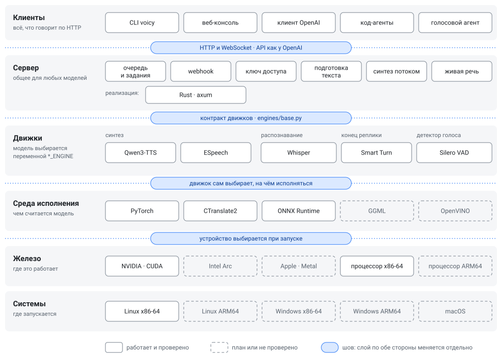

# voicy

Локальный сервер для работы с голосом: синтез речи с клонированием голоса,
распознавание и субтитры, голосовой агент в реальном времени. **API совместимо
с аудио-частью OpenAI**, так что готовые клиенты работают, если сменить базовый
адрес. Всё исполняется на своей машине: звук и текст никуда не уходят, после
первой загрузки весов сеть не нужна.

```bash
curl -O https://raw.githubusercontent.com/olluorg/voicy/master/compose.yml
docker compose up -d
```

Консоль — `http://localhost:8080`, API — `http://localhost:8080/v1`.

Либо один файл без docker и Python — из [выпусков](https://github.com/olluorg/voicy/releases):
`voicy setup && voicy up`. Пока для Linux x86-64 и Windows x86-64
([подробнее](#запуск)).

## Что умеет

**Синтез речи**
- Клонирует голос по образцу в 8–14 секунд, записанному хоть на телефон.
  Расшифровку образца сервер делает сам. Готовых голосов два.
- Форматы `opus`, `mp3`, `wav`, `flac`, `aac`, `pcm`. Темп 0.8–1.2 меняется
  растяжением готового звука: так разборчивость не падает.
- Длинный текст ставится заданием, для живого разговора есть синтез потоком.
- Ударения по знаку: сервер размечает текст (RUAccent) и ставит `U+0301` после
  ударной гласной, а модель, дообученная на этом знаке, читает «сто́ит» и «стои́т»
  так, как размечено. [Послушать](https://olluorg.github.io/voicy/stress/),
  [ADR 0023](docs/adr/0023-stress-marks-by-lora.md).
- Инженерный текст: словарь произношений на 79 терминов и режим, который убирает
  запятые внутри коротких фраз, — модель читает запятую как повод остановиться.

**Распознавание**
- Текст, `srt`, `vtt`, сегменты и слова со временем, перевод на английский.
- Термины слышатся правильно (Kafka, а не «кавка»): для этого есть hotwords
  и именованные профили контекста с заменами.
- Текст приходит по мере распознавания, не дожидаясь конца файла.

**Голосовой агент** — два WebSocket.
- Слушающая сторона: начало речи (чтобы замолчать, когда перебили), текст
  по предложениям и конец реплики по интонации, а не по паузе.
- Говорящая сторона: принимает текст токенами прямо из LLM и отдаёт звук кусками.
  Первый звук приходит меньше чем через секунду, при перебивании синтез отменяется.

**Для работы в сервисе**
- Все запросы идут через одну очередь: у каждого есть id, прогресс, отмена
  и webhook по готовности.
- Ключ доступа, ошибки в формате OpenAI, проверенная работа за nginx.
- Один бинарник или docker; видеокарта не обязательна.

**Сменные модели.** Сервер не знает, как устроена модель: синтез, распознавание,
детекторы конца реплики и голоса стоят за общим контрактом, и модель выбирается
переменной окружения. Почему это держится — [ADR 0021](docs/adr/0021-engine-contract.md).

## Как устроено



Пять слоёв, и любой из них меняется, не трогая соседей, потому что между ними
стоят швы:

- **HTTP и WebSocket API** отделяет клиентов от сервера. Клиенту всё равно,
  на чём написан сервер: он переехал с Python на Rust ([`rust/`](rust/README.md)),
  не поменяв ни одного маршрута, — набор проверок у обоих был один.
- **Контракт движков** (`server/engines/base.py`) отделяет сервер от моделей.
  Сервер говорит на языке API — секунды звука, коды языков, текст — и не знает,
  как устроена модель. Контракт проверен двумя непохожими моделями синтеза
  ([ADR 0021](docs/adr/0021-engine-contract.md)).
- **Среду исполнения выбирает движок.** Одна и та же модель может считаться
  на PyTorch, ONNX Runtime или GGML, и серверу это не важно.
- **Устройство выбирается при запуске:** та же сборка работает с видеокартой
  и без неё.

Пунктиром на схеме — то, чего ещё нет или что не проверялось. С настоящими
моделями проверены Linux x86-64 с NVIDIA (и без видеокарты) и Windows x86-64
с NVIDIA. Под macOS и ARM64 сборка бинарника ещё не отлажена, готовых
библиотек движков там нет — движки идут в Python-процессе.
Цель — Windows, Linux и macOS на x86-64 и ARM64, видеокарты NVIDIA,
Intel Arc и Apple silicon.
На каждом железе — свой самый быстрый путь: охват не покупается скоростью
там, где она уже есть. Как туда идти — [ADR 0022](docs/adr/0022-rust-migration-and-hardware.md).

## Как пользоваться

**Командная строка** — `./voicy`, один файл без зависимостей:

```bash
./voicy up                                   # поднять сервер и прогреть модели
./voicy say "Текст" out.opus                 # синтез
./voicy say @статья.md out.opus --voice dostoevsky --speed 0.9
./voicy hear запись.opus --format srt        # субтитры
./voicy hear созвон.opus --context engineering
./voicy add-voice образец.wav мой-голос      # свой голос
ID=$(./voicy say @книга.md --detach)         # длинное — заданием
./voicy job $ID out.opus --wait
```

**Клиент OpenAI** — тот же код, другой адрес:

```python
from openai import OpenAI
client = OpenAI(base_url="http://localhost:8080/v1", api_key="not-needed")

client.audio.speech.create(model="tts-1", voice="turgenev", input="Текст",
                           response_format="opus").stream_to_file("out.opus")
text = client.audio.transcriptions.create(model="whisper-1",
                                          file=open("out.opus", "rb")).text
```

**Веб-консоль** на `http://localhost:8080` работает в двух режимах.
В простом — поле для текста и одна кнопка, плюс запись с микрофона. В подробном
видны все настройки, есть управление голосами и готовые примеры кода.

Маршруты, параметры, протоколы WebSocket, очередь и webhook, ключ доступа
и настройка прокси — в [`server/README.md`](server/README.md). Код-агенту,
которому нужен звук, достаточно [`AGENTS.md`](AGENTS.md).

## Запуск

Сервер — один бинарник на Rust: из [выпусков](https://github.com/olluorg/voicy/releases),
собранный из `rust/` или в образе docker. `./voicy up` выбирает сам: жив
docker — образ, нет — бинарник (собранный в `rust/target/release/`, заданный
в `VOICY_BIN` или найденный в PATH). Явно — `--docker` или `--native`.

Первый запуск скачивает около восьми гигабайт библиотек и моделей, дальше они
лежат в кэше (`~/.cache/voicy`, в docker — том). Без видеокарты всё работает,
но синтез медленнее реального времени (`./voicy up --cpu`, в docker —
`-e FORCE_CPU=1`). На RTX 3080 синтез в 3.5 раза быстрее реального времени,
на процессоре (Core i5-12600KF, WSL2) — примерно вдвое медленнее: 5.6 с звука
за 10–13 с. `ffmpeg` нужен только для `aac` (в образе он есть): остальные
форматы и темп бинарник кодирует и растягивает сам (experiments/25).

Что где проверено:

| | docker | бинарник |
|---|---|---|
| Linux x86-64, NVIDIA | не проверялось | проверено |
| Linux x86-64, без видеокарты | не проверялось | **проверено**: вдвое медленнее реального времени |
| Windows x86-64, NVIDIA | не проверялось | **проверено** |
| Windows x86-64, через WSL2 | не проверялось | проверено (как Linux) |
| macOS, ARM64 | — | сборка не отлажена; движки только на Python |

До 1.11 в репозитории был и сервер на Python — он запускался `./voicy up --source`.
Его больше нет: `--source` теперь значит то же, что `--native`. Что изменилось
и почему — [ADR 0026](docs/adr/0026-python-server-retired.md).

### Docker — любая система

```bash
curl -O https://raw.githubusercontent.com/olluorg/voicy/master/compose.yml
docker compose up -d
```

`compose.yml` добавляет тома для весов и голосов, перезапуск и проброс GPU.
То же без compose:

```bash
docker run -d --gpus all -p 8080:8080 -v voicy-models:/cache -v voicy-voices:/app/server/voices ghcr.io/olluorg/voicy:latest
```

Образ — Linux x86-64: бинарник на Rust и библиотеки его движков (CUDA 13,
cuDNN, llama.cpp, CTranslate2, ONNX Runtime), без Python и torch. Хосту нужен
драйвер NVIDIA с поддержкой CUDA 13 — 580 или новее — и NVIDIA Container
Toolkit. На Windows — Docker Desktop с WSL2 и обычный драйвер NVIDIA, CUDA
внутри Windows ставить не надо. В PowerShell вместо `curl` — `curl.exe`.
Без видеокарты — без `--gpus all`: сервер увидит, что CUDA-устройств нет,
и сам перейдёт на процессор (`-e FORCE_CPU=1` — то же явно).

До 1.10 в образе был Python-сервер. Тома те же и голоса в том же формате,
но веса другие: в томе `/cache` от прежнего образа остаётся каталог
`huggingface` (около пяти гигабайт), его можно удалить.

### Linux

Готовый файл из выпусков:

```bash
curl -LO https://github.com/olluorg/voicy/releases/latest/download/voicy-linux-x64
chmod +x voicy-linux-x64
./voicy-linux-x64 setup && ./voicy-linux-x64 up
```

Или из исходников — Rust, g++ и CMake нужны только для сборки и `setup`:

```bash
sudo apt install build-essential cmake git        # g++ — обёртке над CTranslate2, cmake — кодеку Opus
curl https://sh.rustup.rs -sSf | sh               # Rust
git clone https://github.com/olluorg/voicy && cd voicy
./voicy up --install                              # сборка, библиотеки и модели, запуск, прогрев
./voicy say "Проверка связи." out.opus
```

`--install` собирает бинарник (`cargo build --release`), если его нет, и качает
библиотеки и модели не спрашивая; без него `setup` сначала покажет, что и куда
ляжет, и дождётся согласия. Повторный `./voicy up` уже ничего не ставит. Сервер
живёт обычным процессом: pid и журнал — в `~/.cache/voicy/run/`, остановка —
`./voicy down`.

### Windows

**Бинарник на Rust** — то, что проверено на Windows с настоящими моделями:
один файл, который сам ставит всё остальное. Синтез и распознавание считаются
в его процессе; ни Python, ни компилятор, ни ffmpeg на машине не нужны. Готовые
сборки прикладываются к выпускам (`voicy-windows-x64.exe`), а собрать самому —
Rust и Build Tools нужны только для этого шага:

```powershell
winget install Rustlang.Rustup Git.Git Microsoft.VisualStudio.2022.BuildTools
git clone https://github.com/olluorg/voicy; cd voicy
cargo build --release --manifest-path rust\Cargo.toml
```

Дальше нужен только сам `voicy.exe` — его можно унести на другую машину:

```powershell
voicy.exe setup            @rem библиотеки и модели, 7.8 ГБ
voicy.exe up               @rem поднять и прогреть
voicy.exe update           @rem обновиться до последнего выпуска
voicy.exe say @текст.txt out.wav
```

Замеры на RTX 3080: синтез 4.56 с звука за 1.07 с (≈×4 к реальному времени),
распознавание — как у faster-whisper, 47 из 47 проверок на машине, где ffmpeg
нет вовсе. `wav`, `opus`, `mp3`, `flac` и изменение темпа — внутри бинарника;
`ffmpeg` нужен только для `aac`.

**Windows предупредит о неизвестном издателе** — файл не подписан сертификатом:
подпись стоит от 150 $ в год, а сервис Microsoft частным лицам вне США и Канады
не продаётся. Вместо неё к каждому файлу выпуска приложены контрольная сумма
и подтверждение сборки от GitHub — их можно проверить:

```powershell
gh attestation verify voicy-windows-x64.exe --repo olluorg/voicy
```

Что именно заверено и как выпускаются файлы —
[docs/code-signing-policy.md](docs/code-signing-policy.md). Кому предупреждение
мешает — собрать самому, командой выше: это тот же код.

Через **WSL2** тоже работает: `wsl --install -d Ubuntu`, дальше внутри Ubuntu
всё как в разделе Linux. Видеокарта NVIDIA видна из WSL2 с обычным драйвером
Windows, консоль и API открываются из Windows по `http://localhost:8080`.

### macOS и ARM64

Готовых сборок нет, и `voicy setup` не поставит движки в процесс: библиотек
под эти системы у него пока нет (ADR 0022, шаг 7). Бинарник, собранный
из исходников, всё равно поднимается: движки он тогда запускает на Python,
из `server/engines/`, — им нужен `.venv` в репозитории:

```bash
brew install uv cmake git                         # на macOS; Rust — https://rustup.rs
git clone https://github.com/olluorg/voicy && cd voicy
uv venv --python 3.12 .venv
uv pip install --python .venv torch torchaudio -r server/requirements.txt
./voicy up --install
```

Считает процессор: видеокарту Apple (MPS, Metal) движки пока не используют,
поэтому синтез заметно медленнее реального времени. С настоящими моделями
на macOS и ARM64 сервер ещё не гонялся. Образ docker на Apple silicon идёт
под эмуляцией x86-64 и для работы непригоден.

### Что внутри бинарника

Все модели исполняются в самом процессе, и команды CLI — в том же файле
(`voicy say`, `hear`, `up`, `status`…). Против прежнего сервера на Python
на RTX 3080 синтез почти втрое быстрее (×3.8 к реальному времени против ×1.4),
распознавание с той же точностью, видеопамяти 5.7 ГБ вместо 9.3
(experiments/20, 22). Кроме CUDA, на Linux и Windows x86-64 `setup` ставит
наборы под Vulkan (любая видеокарта: AMD, Intel, NVIDIA), ROCm, SYCL и один
процессор. Выбор — `VOICY_DEVICE`, по умолчанию — по драйверам машины
(docs/adr/0022). На живых AMD и Arc ещё не мерилось; ARM64 и Apple (Metal) — впереди.

`voicy setup` качает всё сам — показав прежде, что и в какой каталог ляжет,
и дождавшись согласия (`--yes` — не спрашивать): готовые llama.cpp, CTranslate2 и ONNX Runtime,
модели Whisper, Silero, Smart Turn и Qwen3-TTS, переведённый в GGUF и ONNX
([sknyazev/qwen3-tts-12hz-1.7b-base-gguf](https://huggingface.co/sknyazev/qwen3-tts-12hz-1.7b-base-gguf)),
— и на Linux собирает обёртку над CTranslate2: у неё C++-интерфейс, и на это
нужен g++ (на Windows обёртка уже внутри бинарника). Python не нужен ни на одном шаге.

Перевести веса самому (например, другую модель Qwen или другой вариант
квантования) — `scripts/convert_qwen.py`: вот ему нужны PyTorch и официальные
веса. Подробности — [`rust/README.md`](rust/README.md).

## Модели

| | По умолчанию | Ещё | Выбор |
|---|---|---|---|
| синтез | Qwen3-TTS 1.7B, в Rust-сервере — с ударениями по знаку | ESpeech RL-V2 (F5-TTS) | `TTS_ENGINE` |
| ударения | RUAccent (в Rust-сервере, без Python) | — | `--no-stress` |
| распознавание | Whisper large-v3-turbo (faster-whisper) | whisper.cpp — в Rust-сервере | `STT_ENGINE` |
| конец реплики | Smart Turn v3 | — | `TURN_ENGINE` |
| детектор голоса | Silero VAD | — | `VAD_ENGINE` |

Qwen3-TTS заявляет десять языков, проверялся русский. Rust-сервер по умолчанию
берёт её вариант, дообученный слушаться знака ударения
([sknyazev/qwen3-tts-12hz-1.7b-ru-stress-gguf](https://huggingface.co/sknyazev/qwen3-tts-12hz-1.7b-ru-stress-gguf)) —
он только для русского; исходные веса — `VOICY_TTS_GGUF_REPO=sknyazev/qwen3-tts-12hz-1.7b-base-gguf voicy setup models`. ESpeech говорит только
по-русски: при той же разборчивости он быстрее и легче, но с паузами хуже.
Его зависимости ставятся отдельно (`server/requirements-espeech.txt`), сравнение —
[experiments/19](experiments/19-second-engine/README.md).

Новая модель — это один модуль в `server/engines/` по интерфейсу из `base.py`.

## Железо и скорость

RTX 3080 10 ГБ и Core i5-12600KF, модели по умолчанию, Linux (WSL2):

| | |
|---|---|
| синтез | ×3.7–4.2 к реальному времени: минута речи за 15 секунд |
| синтез потоком | первый звук через 0.7 секунды, дальше без пауз |
| распознавание | ×41: пять минут записи за 7 секунд |
| видеопамять всей карты | 5.5 ГБ: хватит карты на 8 ГБ |
| оперативная память | 2.6 ГБ |
| без видеокарты | синтез вдвое медленнее реального времени |

Как мерено и на Windows — раздел «Приёмка» в [`rust/README.md`](rust/README.md).
Проверить у себя — `python scripts/acceptance.py`.

## Откуда взялось

voicy начинался как исследование: как озвучивать инженерные тексты, полные кода,
нотации и терминов, чтобы их можно было усваивать на слух. Итог исследования:
CER обратного распознавания снизился с 25.3% до 0.8%, темп — со 160 до 114 слов
в минуту.

Выводы исследования вошли в сервер: подготовка текста, выбор и нарезка образцов
голоса, отказ от ручки скорости модели. Статья со всеми замерами и аудио —
**https://olluorg.github.io/voicy**. Шестнадцать выводов и как воспроизвести —
[`docs/research.md`](docs/research.md).

## Структура

```
voicy         CLI: весь сервер одной командой
AGENTS.md     инструкция для код-агентов
rust/         сервер на Rust — и CLI в том же бинарнике
server/       что сервер берёт из репозитория: engines/ — движки на Python,
              static/ — консоль, voices/ и contexts/ — голоса и профили
data/         тексты экспериментов
rust/core/    движки как библиотека; assets/ — словарь произношений и голоса
docs/adr/     почему сделано именно так — читать до того, как менять поведение
docs/research.md  исследование, с которого всё началось
docs/code-signing-policy.md  как выпускаются файлы и чем заверены
experiments/  что пробовали и чем мерили; results/ — сырые замеры
scripts/      замеры и прогоны: скорость, память, разборчивость
tests/        проверки API: без моделей за секунды, или против живого сервера
article/      статья по исследованию со всем аудио
```

## Лицензии

Код voicy — MIT. Модели и библиотеки:

| Компонент | Лицензия |
|---|---|
| Qwen3-TTS | Apache-2.0 |
| ESpeech-TTS-1 RL-V2 | Apache-2.0 |
| F5-TTS, Vocos | MIT |
| RUAccent: код / модели | Apache-2.0 / MIT |
| Russian LibriSpeech — данные дообучения ударений | общественное достояние |
| Whisper, faster-whisper, CTranslate2 | MIT |
| llama.cpp, whisper.cpp, ONNX Runtime | MIT |
| libopus | BSD-3-Clause |
| LAME (mp3) | LGPL-2.1 |
| Smart Turn v3 | BSD-2-Clause |
| Silero VAD | MIT |
| образцы голосов (LibriVox) | общественное достояние |
